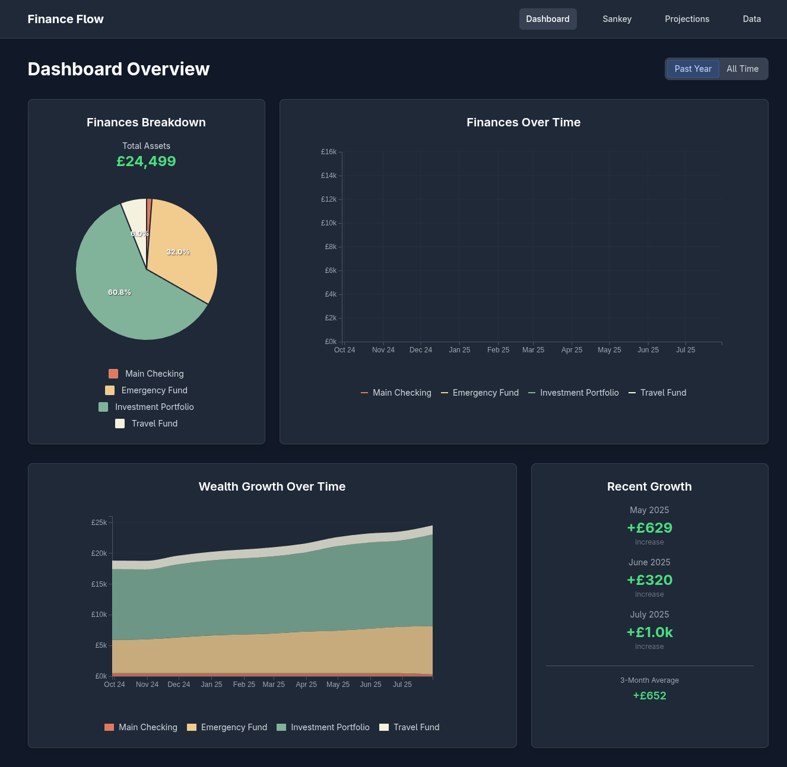
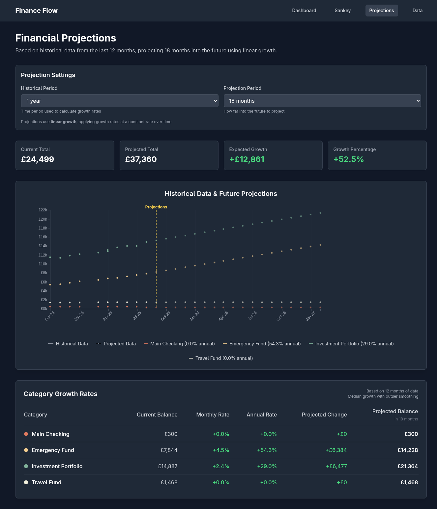
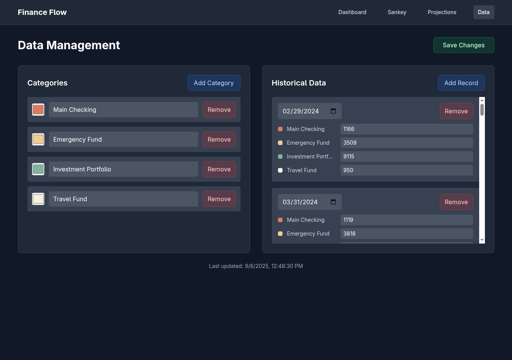

# Finance Flow

A comprehensive financial tracking and visualization application built with React and TypeScript, featuring interactive dashboards and predictive analytics.

## Features

### Dashboard Overview
Get a complete view of your financial health with real-time data visualization.



- **Portfolio breakdown** with interactive pie charts
- **Time-series analysis** of financial growth
- **Wealth tracking** with stacked area charts
- **Recent growth metrics** and 3-month averages

### Financial Projections
Plan your financial future with data-driven projections.



- **Customizable projection periods** (6-18 months)
- **Historical data analysis** with configurable time windows
- **Growth rate calculations** per category
- **Linear growth projections** with detailed metrics
- **Category-specific growth tracking**

### Data Management
Complete control over your financial data with intuitive management tools.



- **Category management** - create, edit, and remove financial categories
- **Historical data entry** with date-based records
- **Real-time data validation** and error handling
- **Import/export capabilities** for data portability

## Tech Stack

- **Frontend**: React 19, TypeScript, Tailwind CSS
- **Backend**: Node.js, Express, TypeScript
- **Visualization**: D3.js
- **State Management**: Zustand
- **Build Tool**: Vite

## Getting Started

1. **Install dependencies**:
   ```bash
   npm install
   ```

2. **Start the development servers**:
   ```bash
   # Frontend (port 5173)
   make dev-frontend
   
   # Backend (port 3001)
   make dev-backend
   ```

3. **Access the application**:
   - Frontend: `http://localhost:5173`
   - Backend API: `http://localhost:3001`

## Project Structure

- `/finance-flow-frontend` - React TypeScript frontend
- `/finance-flow-backend` - Node.js Express API